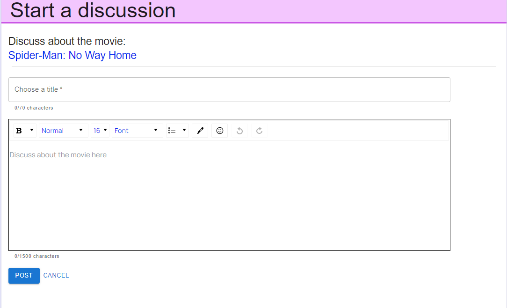
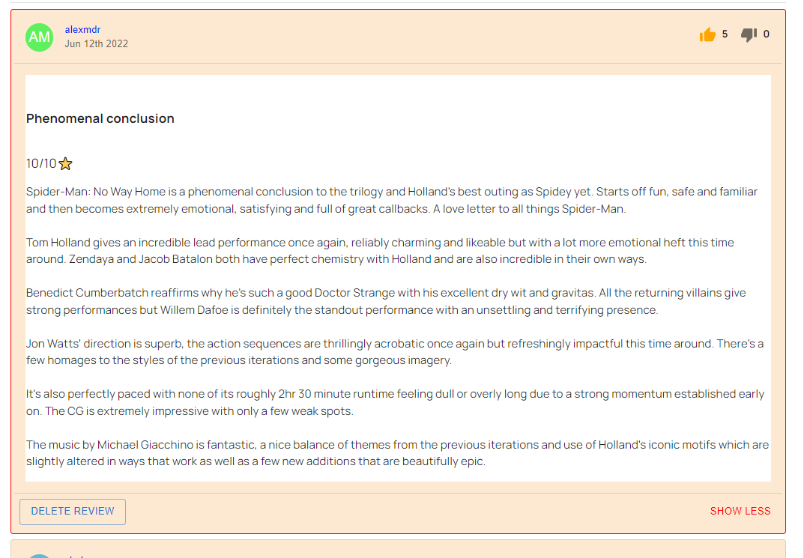

## Movie Platform - MyMovieStand

A responsive full stack application made with React, Express, Sequelize and NodeJs also containing a machine learning feature component that recommends movies with Python and Flask.

Complex responsive layout with interactive UI.

The movie data is populated from TheMovieDatabase Api into the MySQL database and the images and crew images are included directly from an API call to save space.

The Flask server is a machine learning endpoint that provides movie recommendations to the logged users.

This application has 3 types of users:

1. Guests can:

   - signup if they don't have an account/ login into their account
   - search and filter movies
   - view movie details
   - view discussions, reviews and news
   - view watchlists of other users

2. Logged users can:

   - view what guests can
   - recieve and manage notifications
   - create and edit their own watchlist and view the status of the entries anywhere
   - create discussions and reviews
   - like/dislike reviews and view count of likes and dislikes for their own reviews
   - comment on discussions and news
   - delete their own discussions, comments and reviews
   - edit their profile
   - separately view their own discussions, comments and reviews
   - add movies to their profile page favorite category
   - view machine learning recommendations based on what movies they have inside their watchlist or (if they are on a movie page) based on that movie

3. Admins can:

   - do the same actions as logged users
   - create and edit movie news
   - delete users
   - send notifications to a single users or to all users
   - can populate/update the platform's movies if needed
   - restrict or delete posts

Other technologies/libraries used:

- Axios for API calls
- MaterialUI for application design
- Redux & Redux Toolkit for client data storage
- React Router for page navigation
- Moment for data formatting
- draft-wysiwyg built on top of DraftJs for a textarea editor capable of generating JSON objects containing customised text with attachments
- lodash for debounced function that delays invoking other functions
- Sequelize-mig library for generating db migrations
- Sequelize CLI for creating/generating db migrations, models, configs and migrating the changes to the db
- fast-csv for generating the csv file needed by the machine learning server
- Flask for a simple python server that serves as a machine learning endpoint
- sklearn for ml features
- pandas for working with the csv files

### App presentation

#### Header and Menu

The header contains the app logo and depending on the type of user has the following features:

- for guests it is a quick way to signup or login into the app
- for logged users and admins it includes the links to their watchlist, notifications and a dropdown with a link to their profile, reviews, posts, profile editing and also logout function

In the above image the menu is the main navigation of the page and has the links to the 3 main pages of the app:

- Home page
- Movies page
- News page

The current page is marked with a different color for a better user experience.

For admins there is an extra section which redirects to the admin dashboard.

In the right side section of the menu, all users have a search button that expands into a searchbar which then dynamically shows the first 5 movies matching the search based on name and keywords also having the option of having no result and cancelling the search.  
Users can get directly to the respective movie page by clicking on a result.

#### Notifications

The number of notifications a user has can be viewed into the header section.  
When clicking on it, the user can see the last 5 unread notifications and when they were recieved also having the option of clicking on them marking them as "read", which makes them disappear from the dropdown.

By clicking on the option "See all notifications" the user is redirected to the notifications page where all notifications are displayed into a paginated format and they can be managed (user can mark them as read, view old notifications or delete notifications).

#### Home page

The home page has 6 sections:

- a section with the latest 5 news
- a section with the most popular movies (where the user can also add/edit movies to/from their watchlist or see their 'status' )
  

- a section with the top rated movies (where the user can also add/edit movies to/from their watchlist or see their 'status' )
- a section with 5 movies recommended to the user based on their watchlist by the machine learning endpoint which the user can click and then view the movie's individual page
  

- a section with the 5 latests forum discussions
- a section with the 3 latest movie reviews
  

##### Movies page

The movies page is the collection of all the movies and the user can filter movies based on keywords/title(search), genre(checkboxes) and also by duration, most popular, score and date, into an ascending or descending order.

The movies are displayed with server-side and client-side pagination.

Each entry has a small summary of the most important information about a movie, also having a preview button with a portal if it exists.

Here, movies that belong into the watchlist of the user are displayed with a different color based on their status, also having their score,if exists, shown:

- Completed movies - blue
- Plan to watch movies - dark-grey
- Currently Watching movies - green
- Dropped movies - red
- On-Hold movies - yellow
- Movies that are not in the list - white

Users have the option of editing or adding a movie from their watchlist directly from here, similar to the home page, by clicking the '+' or the status button of each movie entry (bottom-left).

Upon clicking on an already existing entry, the user has the existing information auto-completed.

If the user is not logged in, they are prompted to do so if they want to do any actions.

##### Movie page

The movie page contains the most information about the movie.

Users can also edit/add movies from/to their watchlist through a portal and they are also displayed with a representative color, based on their status.

There are 6 main sections:

- Movie details section - all details about the movie and the information from the user's watchlist
- Gallery section - a horizontal scroll gallery with images and some other movie information such as budget and keywords
  

- Cast/Crew section - a vertical scroll gallery for cast and crew
  

- Reviews section - the most liked 2 reviews, each user can have only 1 review and they can directly edit it by clicking top right of the section, they can also see all reviews of the movie by clicking the Show all reviews
  

- Discussions section - the latest 3 discussions, users can make any number of discussions, they can start a new one directly from the top right section and they can see all discussions about the movie by clicking the Show all forum discussions
- Recommendations section - 5 machine learning recommendations based on similarity with the current movie, by clicking on any of them, the user is redirected to the main page of the clicked movie
  

##### Discussions page

Discussions page contains all the discussions about a movie, the user can start new discussions or can view existing discussions by clicking on them.

The discussions are displayed with pagination.

When making a new discussion the user has to choose a title and the body of the topic, the user can customise the post but has a letter limit.

A single discussions has a main discussion title and then the content the user wants to discuss about. After it, comments are displayed with pagination.

Users can simply comment by clicking ADD A COMMENT and they can also customise it

Each comment has a letter limit, after commenting, users can delete their comment by clicking DELETE COMMENT and then Yes on the prompt.

##### Reviews page

Reviews page contains all the reviews about a movie, the user can make only one review per movie but they can edit it anytime.

The reviews are displayed with pagination.

Each logged user can like or dislike a post.

The user reviews are marked with a red border and only they can see the amount of likes and dislikes of them (for unowned reviews only number of likes are visible) and they can also delete the review after confirming a prompt.

When clicking SHOW MORE the reviews expand, revealing the full body of the review.

When making a new review or updating it, the user gets the already existing information and can make any custom post.

##### User Profile

Each logged user has a profile where he can tell others about themselves, they also have their favorite movies and some movie statistics displayed.

In the about section the user can add customised text.

The user's watchlist, discussions and reviews can be viewed by clicking the respective button.

The user that owns the profile can edit the information about themselves at anytime and the already existing information is auto-completed.

They can also edit their favorites, with a limit of 6 max movies displayed, by clicking on the 'heart' or the '-' buttons. An error is displayed if the user tries to add more than 6 movies.

##### User Watchlist

The watchlist page displays all the movies added by the user, with any status.

Movies can be filtered by different criterias by clicking on the headers.

Movies have the representative status color and they can be edited with a portal by clicking EDIT.

##### User Posts

The user's discussions(either their own or comments) can also be viewed into a paginated state from the profile buttons that link to them.

All posts can be viewed into the posts tab and have the movie title they are made about.

The comments and the post where the comment was made can also be viewed in the comments tab.

##### News page

The news page is similar to the discussions page, but the users can only comment on each entry.

##### Admin Dashboard

The admin can moderate (delete/restrict) posts/reviews of every type with the following interface:

Admins can find the id required for the actions by viewing the actual post/review, for example when there is a review it's id is displayed above it, for other types of posts the id is either near it or in the url.

Admins can update movie data such as global rating by pressing a button in the admin movie dashboard.

For creating news the admins have the following interface:

For sending notifications the admins have the following interface:

### How do recommendations work?

After an user has enough entries (movies with the score above 6 and more than 0 entries), one random movie is selected each time from which the backend server sends the title to the flask server that predicts a number of movies (based on their content, using cosine similarity) that are similar to the sent one, after which the express server tries to filter and select a random one, the process repeating 5 times so there would be 5 different results even with the same movie sent 5 times and the predictions having a very high probability of being different each refresh.

### What I learned?

This application was my first big react application so I had to learn a lot, from the project structure to authentication, user experience, responsiveness and data storage and handling.

- managing big project structure for express and react
- how to implement authentication with localstorage and middleware
- how to manage data with redux
- how to make responive complex layouts with as nice as possible UI and design
- how to implement a notification system for the users
- how to manage and use custom posts with draftjs.
- how to implement search and advanced filtering both in client and server side with pagination of the resulted information
- how to work with Sequelize ORM, making migrations and defining the models, implementing complex relations and using complex queries
- how to work with a complex API such as TMDB API
- how to integrate recommendations using machine learning

### What can be improved?

- The app can be refactored with ts for better error handling and stricter implementation
- CSS and MUI can be optimised and improved
- ML recommendations implemented in express server if possible
- Adding some small QOL features

### How to run ?

Frontend(client)

> npx serve -s build

Backend(server)

> npm start

Generating a migration

> npx sequelize-mig migration:make --name changefn --indxp ./models/index.cjs

Migrating to the db

> npx sequelize-cli db:migrate

Flask

> flask run
